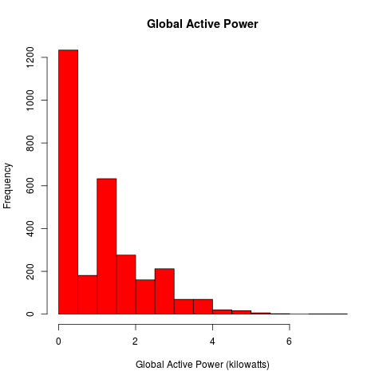
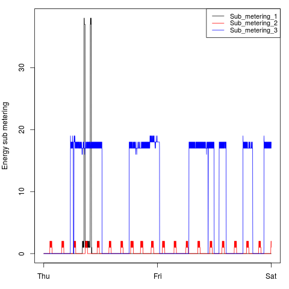
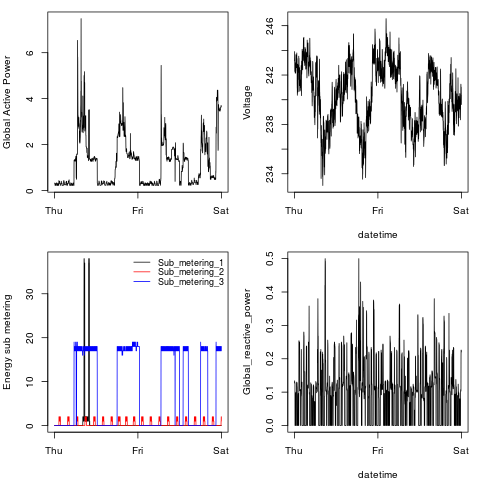

# 004 Exploratory Data Analysis

## Author: Fernando Barranco Rodríguez

#### Exploratory Data Analysis Course Project 1

**Making Plots**

The goal here is simply to examine how household energy usage varies over a 2-day period in February, 2007 (we will only be using data from the dates 2007-02-01 and 2007-02-02). The task is to reconstruct four plots, using the base plotting system.

This assignment uses data from the [UC Irvine Machine Learning Repository](https://archive.ics.uci.edu/ml/datasets/Individual+household+electric+power+consumption), a popular repository for machine learning datasets. In particular, we will be using the “Individual household electric power consumption Data Set”.

You can download the data directly from: [this link.](https://d396qusza40orc.cloudfront.net/exdata%2Fdata%2Fhousehold_power_consumption.zip) (20Mb)

*Descrption:* Measurements of electric power consumption in one household with a one-minute sampling rate over a period of almost 4 years. Different electrical quantities and some sub-metering values are available.

The following descriptions of the 9 variables in the dataset are taken from the UCI web site.

<ol>
<li><b>Date</b>: Date in format dd/mm/yyyy </li>
<li><b>Time</b>: time in format hh:mm:ss </li>
<li><b>Global_active_power</b>: household global minute-averaged active power (in kilowatt) </li>
<li><b>Global_reactive_power</b>: household global minute-averaged reactive power (in kilowatt) </li>
<li><b>Voltage</b>: minute-averaged voltage (in volt) </li>
<li><b>Global_intensity</b>: household global minute-averaged current intensity (in ampere) </li>
<li><b>Sub_metering_1</b>: energy sub-metering No. 1 (in watt-hour of active energy). It corresponds to the kitchen, containing mainly a dishwasher, an oven and a microwave (hot plates are not electric but gas powered). </li>
<li><b>Sub_metering_2</b>: energy sub-metering No. 2 (in watt-hour of active energy). It corresponds to the laundry room, containing a washing-machine, a tumble-drier, a refrigerator and a light. </li>
<li><b>Sub_metering_3</b>: energy sub-metering No. 3 (in watt-hour of active energy). It corresponds to an electric water-heater and an air-conditioner.</li>
</ol>

### Reconstructing the plots:

#### Plot 1

 

#### Plot 2

 

#### Plot 3

 

#### Plot 4

 

