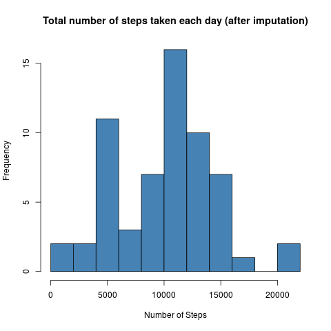
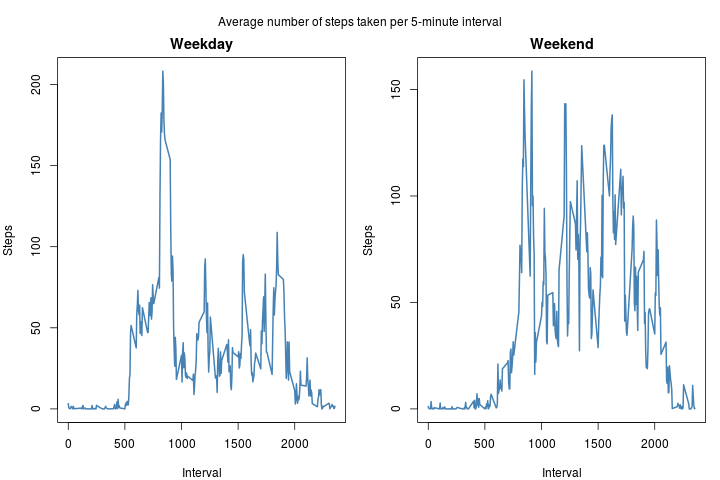

### Assignment

This assignment will be described in multiple parts. You will need to
write a report that answers the questions detailed below. Ultimately,
you will need to complete the entire assignment in a single R markdown
document that can be processed by knitr and be transformed into an HTML
file.

Throughout your report make sure you always include the code that you
used to generate the output you present. When writing code chunks in the
R markdown document, always use echo = TRUE so that someone else will be
able to read the code. This assignment will be evaluated via peer
assessment so it is essential that your peer evaluators be able to
review the code for your analysis.

For the plotting aspects of this assignment, feel free to use any
plotting system in R (i.e., base, lattice, ggplot2)

Fork/clone the GitHub repository created for this assignment. You will
submit this assignment by pushing your completed files into your forked
repository on GitHub. The assignment submission will consist of the URL
to your GitHub repository and the SHA-1 commit ID for your repository
state.

#### Loading and preprocessing the data

Show any code that is needed to:

    # Set working directory
    setwd("C:/Users/FernandoBarranco/Desktop")

    # Download and unzip the dataset (in case you don't have it)
    # url <- "https://d396qusza40orc.cloudfront.net/repdata%2Fdata%2Factivity.zip"
    # download.file(url = url, destfile = "C:/Users/FernandoBarranco/Desktop/activity.zip")
    # unzip(""C:/Users/FernandoBarranco/Desktop/activity.zip")

Load the data (i.e. read.csv())  
Process/transform the data (if necessary) into a format suitable for
your analysis

    # install.packages("data.table")
    library(data.table)
    activity <- fread("C:/Users/FernandoBarranco/Desktop/activity.csv", na.strings = "NA")

#### What is mean total number of steps taken per day?

For this part of the assignment, you can ignore the missing values in
the dataset.

Calculate the total number of steps taken per day  
Make a histogram of the total number of steps taken each day  
Calculate and report the mean and median of the total number of steps
taken per day

    x <- aggregate(steps ~ date, activity, sum)
    hist(x$steps, xlab = "Number of Steps", main = "Total number of steps taken each day",
         col = "steelblue", breaks = 10)

    mean.unimputed <- mean(x$steps, na.rm = T)
    mean.unimputed

    ## [1] 10766.19

    median.unimputed <- median(x$steps, na.rm = T)
    median.unimputed

    ## [1] 10765

#### What is the average daily activity pattern?

Make a time series plot (i.e. type = "l") of the 5-minute interval
(x-axis) and the average number of steps taken, averaged across all days
(y-axis)

    t <- aggregate(steps ~ interval, activity, mean)
    with(t, plot(interval, steps, type = "l", xlab = "Interval", ylab = "Steps", 
                 main = "Average number of steps taken across all days", col = "steelblue", lwd = 2))

Which 5-minute interval, on average across all the days in the dataset,
contains the maximum number of steps?

    t[which(t$steps == max(t$steps)), "interval"]

    ## [1] 835

#### Imputing missing values

Note that there are a number of days/intervals where there are missing
values (coded as NA). The presence of missing days may introduce bias
into some calculations or summaries of the data.

Calculate and report the total number of missing values in the dataset
(i.e. the total number of rows with NAs)

    lapply(lapply(activity, is.na), sum)

    ## $steps
    ## [1] 2304
    ## 
    ## $date
    ## [1] 0
    ## 
    ## $interval
    ## [1] 0

Devise a strategy for filling in all of the missing values in the
dataset. The strategy does not need to be sophisticated. For example,
you could use the mean/median for that day, or the mean for that
5-minute interval, etc.

Create a new dataset that is equal to the original dataset but with the
missing data filled in.

    # source("https://bioconductor.org/biocLite.R")
    # biocLite("impute")
    library(impute)
    activity.imputed <- copy(activity)
    activity.imputed <- as.data.frame(impute.knn(as.matrix(activity.imputed[ , .(steps, interval)]))$data)

    ## Cluster size 17568 broken into 8784 8784 
    ## Cluster size 8784 broken into 4445 4339 
    ## Cluster size 4445 broken into 2250 2195 
    ## Cluster size 2250 broken into 1111 1139 
    ## Done cluster 1111 
    ## Done cluster 1139 
    ## Done cluster 2250 
    ## Cluster size 2195 broken into 862 1333 
    ## Done cluster 862 
    ## Done cluster 1333 
    ## Done cluster 2195 
    ## Done cluster 4445 
    ## Cluster size 4339 broken into 2195 2144 
    ## Cluster size 2195 broken into 980 1215 
    ## Done cluster 980 
    ## Done cluster 1215 
    ## Done cluster 2195 
    ## Cluster size 2144 broken into 2044 100 
    ## Cluster size 2044 broken into 1174 870 
    ## Done cluster 1174 
    ## Done cluster 870 
    ## Done cluster 2044 
    ## Done cluster 100 
    ## Done cluster 2144 
    ## Done cluster 4339 
    ## Done cluster 8784 
    ## Cluster size 8784 broken into 4401 4383 
    ## Cluster size 4401 broken into 2275 2126 
    ## Cluster size 2275 broken into 2007 268 
    ## Cluster size 2007 broken into 845 1162 
    ## Done cluster 845 
    ## Done cluster 1162 
    ## Done cluster 2007 
    ## Done cluster 268 
    ## Done cluster 2275 
    ## Cluster size 2126 broken into 928 1198 
    ## Done cluster 928 
    ## Done cluster 1198 
    ## Done cluster 2126 
    ## Done cluster 4401 
    ## Cluster size 4383 broken into 2187 2196 
    ## Cluster size 2187 broken into 976 1211 
    ## Done cluster 976 
    ## Done cluster 1211 
    ## Done cluster 2187 
    ## Cluster size 2196 broken into 1220 976 
    ## Done cluster 1220 
    ## Done cluster 976 
    ## Done cluster 2196 
    ## Done cluster 4383 
    ## Done cluster 8784

    activity.imputed <- cbind(activity.imputed, date = activity$date)
    head(activity.imputed)

    ##       steps interval       date
    ## 1 9.0000000        0 2012-10-01
    ## 2 2.0000000        5 2012-10-01
    ## 3 0.7777778       10 2012-10-01
    ## 4 0.8888889       15 2012-10-01
    ## 5 0.0000000       20 2012-10-01
    ## 6 1.4444444       25 2012-10-01

Make a histogram of the total number of steps taken each day and
Calculate and report the mean and median total number of steps taken per
day. Do these values differ from the estimates from the first part of
the assignment? What is the impact of imputing missing data on the
estimates of the total daily number of steps?

    h <- aggregate(steps ~ date, activity.imputed, sum)
    hist(h$steps, xlab = "Number of Steps", main = "Total number of steps taken each day (after imputation)",
         col = "steelblue", breaks = 10)

    mean.imputed <- mean(h$steps)
    mean.imputed

    ## [1] 10131.02

    median.imputed <- median(h$steps)
    median.imputed

    ## [1] 10395

    # Diferences before and after imputation
    mean.unimputed - mean.imputed

    ## [1] 635.1723

    median.unimputed - median.imputed

    ## [1] 370

#### Are there differences in activity patterns between weekdays and weekends?

For this part the weekdays() function may be of some help here. Use the
dataset with the filled-in missing values for this part.

Create a new factor variable in the dataset with two levels - "weekday"
and "weekend" indicating whether a given date is a weekday or weekend
day.

    # install.packages("lubridate")
    library(lubridate)
    dates <- as.Date(activity.imputed$date)
    weekdays <- wday(dates, label = T)
    activity.imputed <- cbind(activity.imputed, weekdays)

    weekday <- subset(activity.imputed, weekdays != "Sat" & weekdays != "Sun")
    head(weekday)

    ##       steps interval       date weekdays
    ## 1 9.0000000        0 2012-10-01      Mon
    ## 2 2.0000000        5 2012-10-01      Mon
    ## 3 0.7777778       10 2012-10-01      Mon
    ## 4 0.8888889       15 2012-10-01      Mon
    ## 5 0.0000000       20 2012-10-01      Mon
    ## 6 1.4444444       25 2012-10-01      Mon

    weekend <- subset(activity.imputed, weekdays == "Sat" | weekdays == "Sun")
    head(weekend)

    ##      steps interval       date weekdays
    ## 1441     0        0 2012-10-06      Sat
    ## 1442     0        5 2012-10-06      Sat
    ## 1443     0       10 2012-10-06      Sat
    ## 1444     0       15 2012-10-06      Sat
    ## 1445     0       20 2012-10-06      Sat
    ## 1446     0       25 2012-10-06      Sat

Make a panel plot containing a time series plot (i.e. type = "l") of the
5-minute interval (x-axis) and the average number of steps taken,
averaged across all weekday days or weekend days (y-axis).

    wdy <- aggregate(steps ~ interval, weekday, mean)
    wnd <- aggregate(steps ~ interval, weekend, mean)

    par(mfrow = c(1,2), mar = c(4,4,2,1), oma = c(0,0,2,0))
    with(wdy, plot(interval, steps, type = "l", xlab = "Interval", ylab = "Steps", 
                 main = "Weekday", col = "steelblue", lwd = 2))
    with(wnd, plot(interval, steps, type = "l", xlab = "Interval", ylab = "Steps", 
                 main = "Weekend", col = "steelblue", lwd = 2))
    mtext("Average number of steps taken per 5-minute interval", outer = T)

