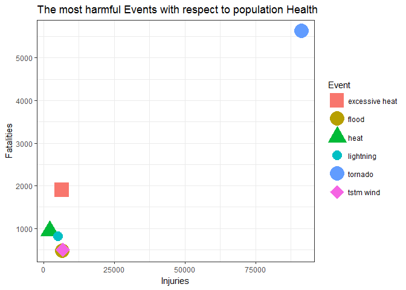
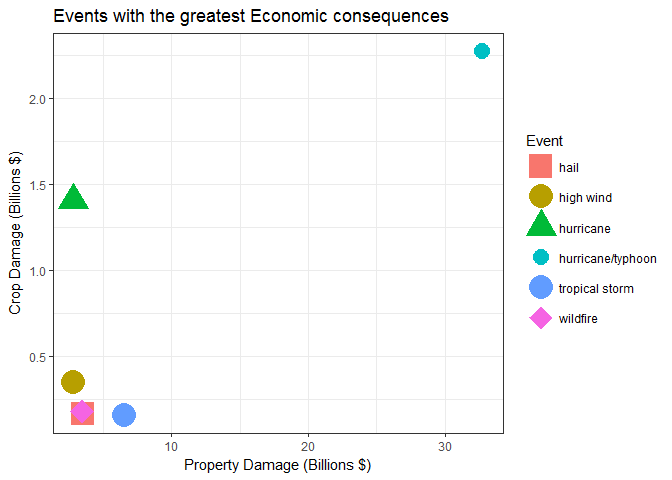

Course Project 2
================

The most severe weather events across the US from 1950 to 2011
--------------------------------------------------------------

*Important: If you want to run the entire code, just get rid of all the
'\#' symbols whenever you see an R chunk.*

Synopsis: Severe weather events can cause both public health
(fatalities, injuries) and economic problems (property damage) for
communities, and preventing such outcomes is a key concern; this project
involves exploring the U.S. National Oceanic and Atmospheric
Administration's (NOAA) storm database wich tracks characteristics of
major storms and weather events in the United States, including when and
where they occur, as well as estimates of any fatalities, injuries, and
property damage, the events in the database start in the year 1950 and
end in November 2011.

The goal of the proyect is to answer two questions; across the United
States:

-   Which types of events are most harmful with respect to population
    health?

-   Which types of events have the greatest economic consequences?

Set working directory

    setwd("C:/Users/FernandoBarranco/Desktop")

### Data Processing

Download the data from the following url (if necessary)

    url <- "https://d396qusza40orc.cloudfront.net/repdata%2Fdata%2FStormData.csv.bz2"
    # download.file(url, "C:/Users/FernandoBarranco/Desktop/StormData.csv.bz2")

Unzip the .csv file

    # install.packages("R.utils")
    # library(R.utils)
    # bunzip2("StormData.csv.bz2", "StormData.csv", remove = FALSE, skip = TRUE)

Read the data into R

    # install.packages("data.table")
    library(data.table)
    storm_data <- fread("StormData.csv")

    ## 
    Read 0.0% of 967216 rows
    Read 26.9% of 967216 rows
    Read 42.4% of 967216 rows
    Read 58.9% of 967216 rows
    Read 74.4% of 967216 rows
    Read 87.9% of 967216 rows
    Read 902297 rows and 37 (of 37) columns from 0.523 GB file in 00:00:09

### Subset, transform and clean the data

Rename variables

    # install.packages("dplyr")
    library(dplyr)
    # install.packages("lubridate")
    library(lubridate)
    variables <- names(storm_data)
    names(storm_data) <- tolower(variables)

Keep variables to analyze

    storm_data_sub <- storm_data %>% select(bgn_date, state, evtype, fatalities,
                          injuries, propdmg, propdmgexp, cropdmg, cropdmgexp)

Change to date format

    storm_data_sub$bgn_date <- as.Date(storm_data_sub$bgn_date, format = "%m/%d/%Y %H:%M:%S")

Removing observations with no fatalities nor injuries

    storm_data_sub <- storm_data_sub %>%
            mutate(year = year(bgn_date), evtype = tolower(evtype)) %>%
            select(-bgn_date, state, evtype, fatalities, injuries, year) %>%
            filter(fatalities != 0 | injuries != 0)
    head(storm_data_sub)

    ##   state  evtype fatalities injuries propdmg propdmgexp cropdmg cropdmgexp
    ## 1    AL tornado          0       15    25.0          K       0           
    ## 2    AL tornado          0        2    25.0          K       0           
    ## 3    AL tornado          0        2     2.5          K       0           
    ## 4    AL tornado          0        2     2.5          K       0           
    ## 5    AL tornado          0        6     2.5          K       0           
    ## 6    AL tornado          0        1     2.5          K       0           
    ##   year
    ## 1 1950
    ## 2 1951
    ## 3 1951
    ## 4 1951
    ## 5 1951
    ## 6 1951

### Data wrangling and feature engineering

Sum up fatalities and injuries by event type

    fatalities <- aggregate(fatalities ~ evtype, storm_data_sub, sum)
    head(fatalities)

    ##         evtype fatalities
    ## 1     avalance          1
    ## 2    avalanche        224
    ## 3    black ice          1
    ## 4     blizzard        101
    ## 5 blowing snow          2
    ## 6   brush fire          0

    injuries <- aggregate(injuries ~ evtype, storm_data_sub, sum)
    head(injuries)

    ##         evtype injuries
    ## 1     avalance        0
    ## 2    avalanche      170
    ## 3    black ice       24
    ## 4     blizzard      805
    ## 5 blowing snow       14
    ## 6   brush fire        2

Keep extreme values that causes the highest damages

    storm_data_health <- inner_join(fatalities, injuries, by = "evtype") %>%
            filter(fatalities > quantile(fatalities, probs = .97) &
                    injuries > quantile(injuries, probs = .97))
    storm_data_health

    ##           evtype fatalities injuries
    ## 1 excessive heat       1903     6525
    ## 2          flood        470     6789
    ## 3           heat        937     2100
    ## 4      lightning        816     5230
    ## 5        tornado       5633    91346
    ## 6      tstm wind        504     6957

*Note: The 'storm\_data\_health' dataset will help us answer question 1*

Property damages counts

    table(storm_data_sub$propdmgexp)

    ## 
    ##           -     0     5     7     B     H     K     m     M 
    ##  7248     1     5     1     1    19     1 11155     1  3497

    table(storm_data_sub$cropdmgexp)

    ## 
    ##           0     B     K     M 
    ## 17490     1     1  4253   184

Map property damage alphanumeric exponents to numeric values.

    propdmgkey_level <- c("-", "0", "5", "7", "H", "K", "M", "B")
    propdmgkey_label <- c( 10^0+1 , 10^0, 10^5, 10^7, 10^2, 10^3, 10^6, 10^9 )

Map crop damage alphanumeric exponents to numeric values

    cropdmgkey_level <- c("0", "K", "M", "B")
    cropdmgkey_label <- c( 10^0, 10^3, 10^6, 10^9 )

Create new variables that contain the total property damage

    storm_data_eco <- storm_data_sub %>%
            select(-(c(state, fatalities, injuries, year))) %>%
            mutate(propdmgexp = toupper(propdmgexp),
                   cropdmgkey = factor(cropdmgexp, cropdmgkey_level, cropdmgkey_label),
                   propdmgkey = factor(propdmgexp, propdmgkey_level, propdmgkey_label),
                   cropdmgkey = as.numeric(as.character(cropdmgkey)),
                   propdmgkey = as.numeric(as.character(propdmgkey)),
                   propdmgtot = propdmg * propdmgkey,
                   cropdmgtot = cropdmg * cropdmgkey )
    head(storm_data_eco)

    ##    evtype propdmg propdmgexp cropdmg cropdmgexp cropdmgkey propdmgkey
    ## 1 tornado    25.0          K       0                    NA       1000
    ## 2 tornado    25.0          K       0                    NA       1000
    ## 3 tornado     2.5          K       0                    NA       1000
    ## 4 tornado     2.5          K       0                    NA       1000
    ## 5 tornado     2.5          K       0                    NA       1000
    ## 6 tornado     2.5          K       0                    NA       1000
    ##   propdmgtot cropdmgtot
    ## 1      25000         NA
    ## 2      25000         NA
    ## 3       2500         NA
    ## 4       2500         NA
    ## 5       2500         NA
    ## 6       2500         NA

Sum up property damage by event type

    propdmgtotal <- aggregate(propdmgtot ~ evtype, storm_data_eco, sum)
    head(propdmgtotal)

    ##                     evtype propdmgtot
    ## 1                avalanche     728800
    ## 2                 blizzard  526756000
    ## 3             blowing snow      15000
    ## 4            coastal flood    1000000
    ## 5         coastal flooding      35000
    ## 6 coastal flooding/erosion    1700000

    cropdmgtotal <- aggregate(cropdmgtot ~ evtype, storm_data_eco, sum)
    head(cropdmgtotal)

    ##            evtype cropdmgtot
    ## 1       avalanche          0
    ## 2        blizzard  112050000
    ## 3   coastal flood          0
    ## 4 cold/wind chill          0
    ## 5       dense fog          0
    ## 6         drought    2000000

Keep extreme values that causes the highest damages

    storm_data_economy <- full_join(propdmgtotal, cropdmgtotal, by = "evtype") %>%
            filter( propdmgtot > quantile(propdmgtot, probs = .90, na.rm = T) &
                    cropdmgtot > quantile(cropdmgtot, probs = .90, na.rm = T))
    storm_data_economy

    ##              evtype  propdmgtot cropdmgtot
    ## 1              hail  3505785701  166300000
    ## 2         high wind  2818983110  351980100
    ## 3         hurricane  2812660000 1406720000
    ## 4 hurricane/typhoon 32747770000 2273120800
    ## 5    tropical storm  6560156000  157265000
    ## 6          wildfire  3484359200  182087000

*Note: The 'storm\_data\_economy' dataset will help us answer question
2*

### Results

    # install.packages("ggplot2")
    library(ggplot2)

-   Which types of events are most harmful with respect to population
    health?

<!-- -->

    ggplot(storm_data_health, aes(injuries, fatalities, color = evtype, shape = evtype)) +
            geom_point(size = 8, alpha = 1) +
            guides(color = guide_legend("Event")) +
            theme_set(theme_bw()) + 
            labs(x = "Injuries", y = "Fatalities",
                 title = "The most harmful Events with respect to population Health") +
            scale_shape_manual(name = "Event",
                               values = c(15, 16, 17, 20, 19, 18))

Notice that tornado has the highest values for both injuries and
fatalities, this event is the most harmful to population health.

-   Which types of events have the greatest economic consequences?

<!-- -->

    ggplot(storm_data_economy, aes(propdmgtot/10^9, cropdmgtot/10^9, shape = evtype)) +
            geom_point(size = 8, alpha = 1, aes(color = evtype)) +
            guides(color = guide_legend("Event")) +
            theme_set(theme_bw()) + 
            labs(x = "Property Damage (Billions $)", y = "Crop Damage (Billions $)",
                 title = "Events with the greatest Economic consequences") +
            scale_shape_manual(name = "Event",
                               values = c(15, 16, 17, 20, 19, 18))

Notice that hurricane/typhoon has the highest values for property
damage, this event causes the greatest economic losses.
