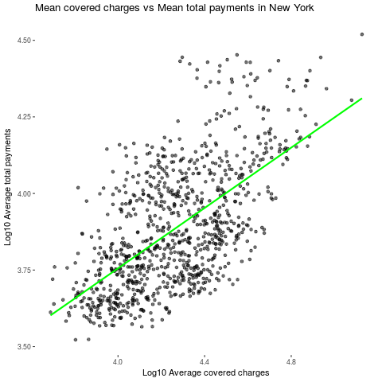
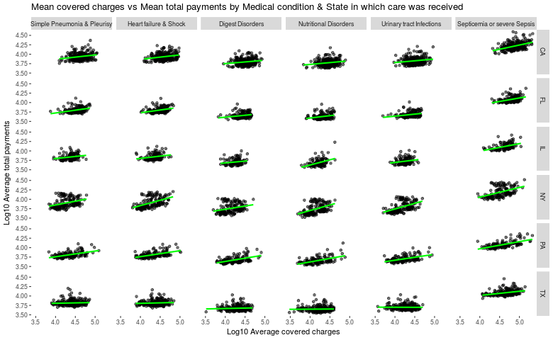

# 005 Reproducible Research

## Author: Fernando Barranco Rodríguez

### Plotting Practice (Optional)

To practice the plotting techniques you have learned so far, you will be making a graphic that explores relationships between variables. This practice is useful since we will later cover creating reproducible graphics in this class. You will be looking at a subset of a United States medical expenditures dataset with information on costs for different medical conditions and in different areas of the country.

You should do the following:

1.Make a plot that answers the question: what is the relationship between mean covered charges (Average.Covered.Charges) and mean total payments (Average.Total.Payments) in New York?

2.Make a plot (possibly multi-panel) that answers the question: how does the relationship between mean covered charges (Average.Covered.Charges) and mean total payments (Average.Total.Payments) vary by medical condition (DRG.Definition) and the state in which care was received (Provider.State)?

*Use only the ggplot2 graphics system (not base R or lattice) to make your figure.*

To make the plots use the data in the attached .csv file. These data are a processed version of the data from the site: [https://data.cms.gov/Medicare/Inpatient-Prospective-Payment-System-IPPS-Provider/97k6-zzx3](https://data.cms.gov/Medicare-Inpatient/Inpatient-Prospective-Payment-System-IPPS-Provider/97k6-zzx3)

You can directly download the data from this link: [payments.csv](https://d3c33hcgiwev3.cloudfront.net/_e143dff6e844c7af8da2a4e71d7c054d_payments.csv?Expires=1501027200&Signature=iLCEcmu~VvWigcXIwq7zk1kYQZ9P-b3R8Xes-nPpyVSrDGYAsjODfbRmA4eIHx~0B8j3G7Lencc2qtXjGbyT-PaO~O0G2E57uyA55CWi17R2XYFqK727~BonrvULc9y6CF4T29TU3dNxl2FkjbIWdZCUHr6e0wgtubUIZAMrOZE_&Key-Pair-Id=APKAJLTNE6QMUY6HBC5A)

#### 1. What is the relationship between mean covered charges (Average.Covered.Charges) and mean total payments (Average.Total.Payments) in New York?

#### 2. How does the relationship between mean covered charges (Average.Covered.Charges) and mean total payments (Average.Total.Payments) vary by medical condition (DRG.Definition) and the state in which care was received (Provider.State)?

