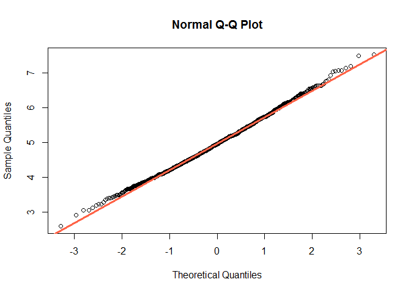

Part 1: Simulation
------------------

Comparition between the exponential distribution in R and the Central
Limit Theorem. The exponential distribution has two parameters:
'lambda': the rate parameter and 'n': the number of observations. The
mean of an exponential distribution is 1/lambda, the standard deviation
is also 1/lambda.

    # Number of observations
    n <- 40

    # Mean and Std Deviation 'lambda'
    lambda <- 0.2

    # Number of simulations
    sim <- 1000

    # Defining an empty vector
    vect <- as.numeric()

    # Looping a 1000 simulations
    for (i in 1:sim){
            vect <- c(vect, mean(rexp(n, lambda)) ) }

    # Creating a plotting environment
    par(mfrow = c(1,2))

    # Pseudo random number, for reproducibilty sake
    set.seed(12345)

    # First plot (Exponenctial Distribution)
    hist(rexp(sim, lambda), col = "blue", xlab = "1000 Simulations",
         main = "Exponential Distribution", freq = FALSE)
    abline(v= mean(rexp(sim, lambda)), col = "green", lwd = 2)
    legend(x = "topright", legend = "Exponential Mean", col = "green", lty = 1,
           lwd = 3, cex = 0.5)

    # Second plot (Distribution of Averages)
    hist(vect, col = "blue", main = "Distribution of Averages",
         breaks = 10, xlab = "n = 40  lambda = 0.2", freq = FALSE)
    abline(v = mean(vect), col = "orange", lwd = 2)
    abline(v = 1/lambda, col = "green", lwd = 2)
    abline(v = sd(vect)*c(-1,1)+mean(vect), col = "tomato", lwd = 2)
    abline(v = (1/lambda)/sqrt(n)*c(-1,1)+(1/lambda), col = "yellow", lwd = 2)
    curve(dnorm(x, mean = mean(vect), sd = sd(vect)), col = "darkblue", lwd = 2, add = TRUE)
    legend(x = "topright", lty = 1, cex = 0.3, lwd = 3,
           col = c("green", "orange", "tomato", "yellow", "darkblue"),
           legend = c("Theoretical Mean", "Sample Mean", "Theoretical StdDev",
                      "Sample StdDev", "Normal Dist"))

-   Show the sample mean and compare it to the theoretical mean of
    the distribution.

<!-- -->

    sample.mean <- mean(vect)
    sample.mean

    ## [1] 4.983688

    theoretical.mean <- 1/lambda
    theoretical.mean

    ## [1] 5

-   Show how variable the sample is (via variance) and compare it to the
    theoretical variance of the distribution.

<!-- -->

    sample.variance <- sd(vect)^2
    sample.variance

    ## [1] 0.577804

    theoretical.variance <- ((1/lambda)/sqrt(n))^2
    theoretical.variance

    ## [1] 0.625

-   Show that the distribution is approximately normal.

<!-- -->

    par(mfrow = c(1,1))
    qqnorm(vect)
    qqline(vect, col = "tomato", lwd = 3)

    # Interpretation: If the Sample quantiles provide from a Normal Distribution, then it 
    #                 should be the same as the Theoretical quantiles matching an Identity Line. 

Part 2: Inferential Data Analysis
---------------------------------

Analyze the ToothGrowth data in the R datasets package.

"The Effect of Vitamin C on Tooth Growth in Guinea Pigs"

*Description:* The response is the length of odontoblasts (cells
responsible for tooth growth) in 60 guinea pigs. Each animal received
one of three dose levels of vitamin C (0.5, 1, and 2 mg/day) by one of
two delivery methods, (orange juice or ascorbic acid (a form of vitamin
C and coded as VC).

A data frame with 60 observations on 3 variables.

<table>
<thead>
<tr class="header">
<th>Variable</th>
<th>Type</th>
<th>Description</th>
</tr>
</thead>
<tbody>
<tr class="odd">
<td><strong>len</strong></td>
<td>numeric</td>
<td>Tooth length</td>
</tr>
<tr class="even">
<td><strong>supp</strong></td>
<td>factor</td>
<td>Supplement type (VC or OJ).</td>
</tr>
<tr class="odd">
<td><strong>dose</strong></td>
<td>numeric</td>
<td>Dose in milligrams/day</td>
</tr>
</tbody>
</table>

-   Load the ToothGrowth data and perform some basic exploratory data
    analyses

<!-- -->

    Tooth <- datasets::ToothGrowth
    Tooth

    ##     len supp dose
    ## 1   4.2   VC  0.5
    ## 2  11.5   VC  0.5
    ## 3   7.3   VC  0.5
    ## 4   5.8   VC  0.5
    ## 5   6.4   VC  0.5
    ## 6  10.0   VC  0.5
    ## 7  11.2   VC  0.5
    ## 8  11.2   VC  0.5
    ## 9   5.2   VC  0.5
    ## 10  7.0   VC  0.5
    ## 11 16.5   VC  1.0
    ## 12 16.5   VC  1.0
    ## 13 15.2   VC  1.0
    ## 14 17.3   VC  1.0
    ## 15 22.5   VC  1.0
    ## 16 17.3   VC  1.0
    ## 17 13.6   VC  1.0
    ## 18 14.5   VC  1.0
    ## 19 18.8   VC  1.0
    ## 20 15.5   VC  1.0
    ## 21 23.6   VC  2.0
    ## 22 18.5   VC  2.0
    ## 23 33.9   VC  2.0
    ## 24 25.5   VC  2.0
    ## 25 26.4   VC  2.0
    ## 26 32.5   VC  2.0
    ## 27 26.7   VC  2.0
    ## 28 21.5   VC  2.0
    ## 29 23.3   VC  2.0
    ## 30 29.5   VC  2.0
    ## 31 15.2   OJ  0.5
    ## 32 21.5   OJ  0.5
    ## 33 17.6   OJ  0.5
    ## 34  9.7   OJ  0.5
    ## 35 14.5   OJ  0.5
    ## 36 10.0   OJ  0.5
    ## 37  8.2   OJ  0.5
    ## 38  9.4   OJ  0.5
    ## 39 16.5   OJ  0.5
    ## 40  9.7   OJ  0.5
    ## 41 19.7   OJ  1.0
    ## 42 23.3   OJ  1.0
    ## 43 23.6   OJ  1.0
    ## 44 26.4   OJ  1.0
    ## 45 20.0   OJ  1.0
    ## 46 25.2   OJ  1.0
    ## 47 25.8   OJ  1.0
    ## 48 21.2   OJ  1.0
    ## 49 14.5   OJ  1.0
    ## 50 27.3   OJ  1.0
    ## 51 25.5   OJ  2.0
    ## 52 26.4   OJ  2.0
    ## 53 22.4   OJ  2.0
    ## 54 24.5   OJ  2.0
    ## 55 24.8   OJ  2.0
    ## 56 30.9   OJ  2.0
    ## 57 26.4   OJ  2.0
    ## 58 27.3   OJ  2.0
    ## 59 29.4   OJ  2.0
    ## 60 23.0   OJ  2.0

    library(ggplot2)

    ggplot(Tooth) +
            geom_bar(aes(len)) +
            facet_grid(dose ~ supp) +
            theme_set(theme_bw()) + 
            labs(x = "Lenght of odontoblasts", y = "Count",
                 title = "Supplement type vs Dose (milligrams/day)")

    ggplot(Tooth, aes(x = supp, y = len)) +
            geom_boxplot() +
            theme_set(theme_bw()) + 
            labs(x = "Supplement type", y = "Lenght of odontoblasts",
                 title = "Supplementation lenght")

    ggplot(Tooth, aes(x = factor(dose), y = len)) +
            geom_boxplot() +
            theme_set(theme_bw()) + 
            labs(x = "Dose (milligrams/day)", y = "Lenght of odontoblasts",
                 title = "Dose lenght")

-   Provide a basic summary of the data.

<!-- -->

    library(dplyr)

    Tooth.total <- Tooth %>% group_by(supp, dose) %>%
            summarise(total_len = sum(len))
    Tooth.total

    ## # A tibble: 6 x 3
    ## # Groups:   supp [?]
    ##     supp  dose total_len
    ##   <fctr> <dbl>     <dbl>
    ## 1     OJ   0.5     132.3
    ## 2     OJ   1.0     227.0
    ## 3     OJ   2.0     260.6
    ## 4     VC   0.5      79.8
    ## 5     VC   1.0     167.7
    ## 6     VC   2.0     261.4

-   Use confidence intervals and/or hypothesis tests to compare tooth
    growth by supp and dose. (Only use the techniques from class, even
    if there's other approaches worth considering)

We want to know if tooth growth is statistally different by supplement
(increase/decrease on average) for each dose, for that purpose we create
three different 95% confidence intervals for the mean diference (Orange
Juice - Ascorbic Acid).

    # Growth by dose of 0.5 milligrams per day
    test1 <- Tooth %>% filter(dose == 0.5) %>% print

    ##     len supp dose
    ## 1   4.2   VC  0.5
    ## 2  11.5   VC  0.5
    ## 3   7.3   VC  0.5
    ## 4   5.8   VC  0.5
    ## 5   6.4   VC  0.5
    ## 6  10.0   VC  0.5
    ## 7  11.2   VC  0.5
    ## 8  11.2   VC  0.5
    ## 9   5.2   VC  0.5
    ## 10  7.0   VC  0.5
    ## 11 15.2   OJ  0.5
    ## 12 21.5   OJ  0.5
    ## 13 17.6   OJ  0.5
    ## 14  9.7   OJ  0.5
    ## 15 14.5   OJ  0.5
    ## 16 10.0   OJ  0.5
    ## 17  8.2   OJ  0.5
    ## 18  9.4   OJ  0.5
    ## 19 16.5   OJ  0.5
    ## 20  9.7   OJ  0.5

    n_x <- 10 ; n_y <- 10
    x_bar <- mean(test1$len[1:10]); y_bar <- mean(test1$len[11:20])
    sd_x <- sd(test1$len[1:10]); sd_y <- sd(test1$len[11:20])
    alpha <- 0.05
    S_p <- sqrt( ((n_x-1)*sd_x^2 + (n_y-1)*sd_y^2) / (n_x+n_y-2) )
    t_s <- qt(1-alpha/2, n_x+n_y-2)
    round( (y_bar - x_bar) + c(-1, 1) * t_s * S_p * (sqrt(1/n_x + 1/n_y)), 3)

    ## [1] 1.77 8.73

    # Growth by dose of 1.0 milligrams per day
    test2 <- Tooth %>% filter(dose == 1) %>% print

    ##     len supp dose
    ## 1  16.5   VC    1
    ## 2  16.5   VC    1
    ## 3  15.2   VC    1
    ## 4  17.3   VC    1
    ## 5  22.5   VC    1
    ## 6  17.3   VC    1
    ## 7  13.6   VC    1
    ## 8  14.5   VC    1
    ## 9  18.8   VC    1
    ## 10 15.5   VC    1
    ## 11 19.7   OJ    1
    ## 12 23.3   OJ    1
    ## 13 23.6   OJ    1
    ## 14 26.4   OJ    1
    ## 15 20.0   OJ    1
    ## 16 25.2   OJ    1
    ## 17 25.8   OJ    1
    ## 18 21.2   OJ    1
    ## 19 14.5   OJ    1
    ## 20 27.3   OJ    1

    n_x <- 10 ; n_y <- 10
    x_bar <- mean(test2$len[1:10]); y_bar <- mean(test2$len[11:20])
    sd_x <- sd(test2$len[1:10]); sd_y <- sd(test2$len[11:20])
    alpha <- 0.05
    S_p <- sqrt( ((n_x-1)*sd_x^2 + (n_y-1)*sd_y^2) / (n_x+n_y-2) )
    t_s <- qt(1-alpha/2, n_x+n_y-2)
    round( (y_bar - x_bar) + c(-1, 1) * t_s * S_p * (sqrt(1/n_x + 1/n_y)), 3)

    ## [1] 2.841 9.019

    # Growth by dose of 2.0 milligrams per day
    test3 <- Tooth %>% filter(dose == 2) %>% print

    ##     len supp dose
    ## 1  23.6   VC    2
    ## 2  18.5   VC    2
    ## 3  33.9   VC    2
    ## 4  25.5   VC    2
    ## 5  26.4   VC    2
    ## 6  32.5   VC    2
    ## 7  26.7   VC    2
    ## 8  21.5   VC    2
    ## 9  23.3   VC    2
    ## 10 29.5   VC    2
    ## 11 25.5   OJ    2
    ## 12 26.4   OJ    2
    ## 13 22.4   OJ    2
    ## 14 24.5   OJ    2
    ## 15 24.8   OJ    2
    ## 16 30.9   OJ    2
    ## 17 26.4   OJ    2
    ## 18 27.3   OJ    2
    ## 19 29.4   OJ    2
    ## 20 23.0   OJ    2

    n_x <- 10 ; n_y <- 10
    x_bar <- mean(test3$len[1:10]); y_bar <- mean(test3$len[11:20])
    sd_x <- sd(test3$len[1:10]); sd_y <- sd(test3$len[11:20])
    alpha <- 0.05
    S_p <- sqrt( ((n_x-1)*sd_x^2 + (n_y-1)*sd_y^2) / (n_x+n_y-2) )
    t_s <- qt(1-alpha/2, n_x+n_y-2)
    round( (y_bar - x_bar) + c(-1, 1) * t_s * S_p * (sqrt(1/n_x + 1/n_y)), 3)

    ## [1] -3.723  3.563

-   State your conclusions and the assumptions needed for
    your conclusions.

<table style="width:64%;">
<colgroup>
<col width="8%" />
<col width="6%" />
<col width="27%" />
<col width="20%" />
</colgroup>
<thead>
<tr class="header">
<th>Test</th>
<th>Dose</th>
<th>Confidence Interval</th>
<th>Interpretation</th>
</tr>
</thead>
<tbody>
<tr class="odd">
<td>1</td>
<td>0.5</td>
<td>1.77 - 8.73</td>
<td>For a dose level of 0.5 mg/day of vitamine c, the orange juice produces a bigger growth on the length of odontoblasts than ascorbic acid.</td>
</tr>
<tr class="even">
<td>2</td>
<td>1.0</td>
<td>2.841 - 9.019</td>
<td>For a dose level of 1.0 mg/day of vitamine c, the orange juice produces a bigger growth on the length of odontoblasts than ascorbic acid.</td>
</tr>
<tr class="odd">
<td>3</td>
<td>2.0</td>
<td>-3.723 - 3.563</td>
<td>For a dose level of 2.0 mg/day of vitamine c, the orange juice produces the same growth on the length of odontoblasts (on average)than ascorbic acid.</td>
</tr>
</tbody>
</table>
